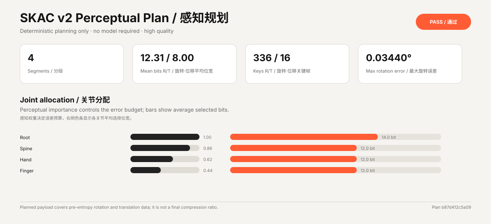
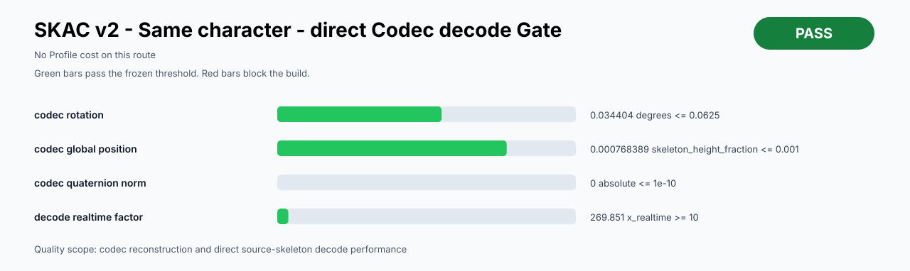
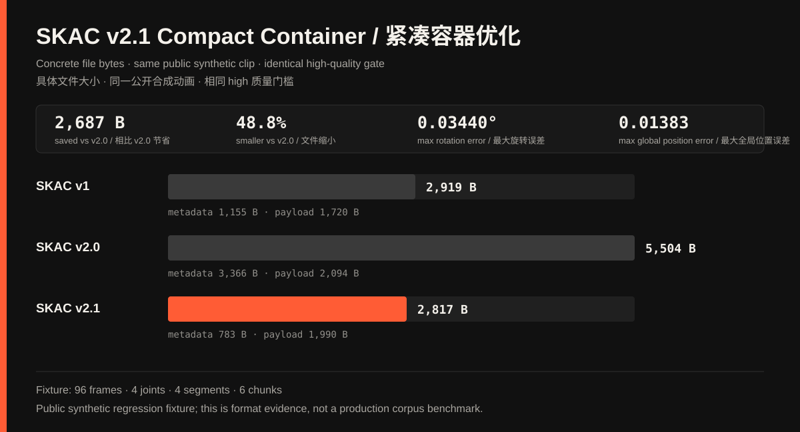
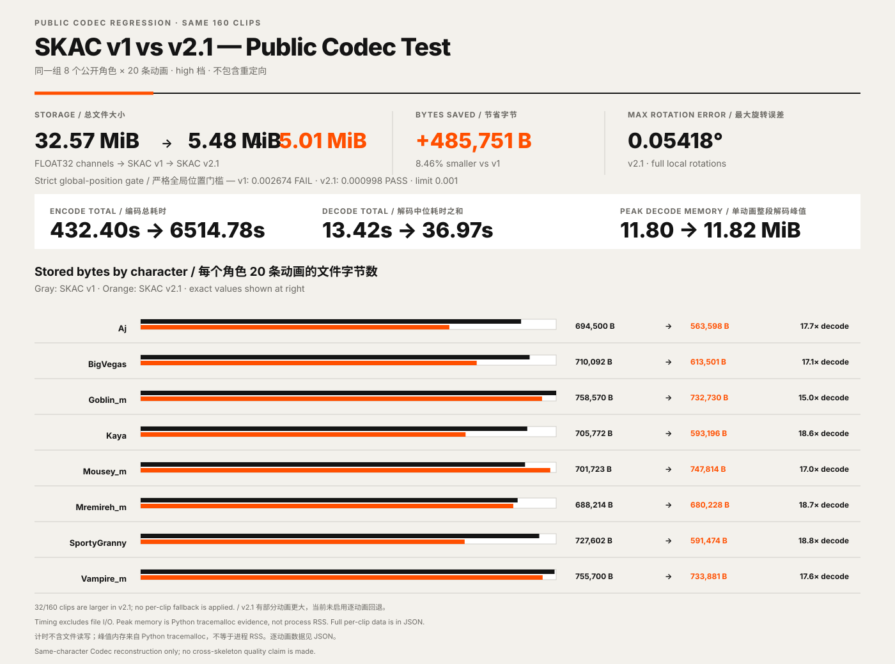

# SKAC Motion Runtime Beta

[English](#english) | [中文](#chinese)

<a id="english"></a>

## English

The Motion Runtime is an optional layer above the deterministic SKAC Codec. Authored
animation remains decodable without a model. The optional runtime may use phase,
contacts, root trajectory, events, and semantic tags to build smoother transitions or
generate missing in-between frames.

The public architecture has three independent parts:

1. **SKAC v2**: deterministic clip data, adaptive bit allocation, temporal segments,
   random access, and progressive refinement layers.
2. **SKAC Pack v1**: library index and exact content-addressed blob sharing today,
   followed by compatible shared track and segment dictionaries.
3. **SKAC Motion Runtime Beta**: deterministic semantic interpolation first, with an
   optional neural in-betweening plugin later.

The generation layer must not overwrite source keys, change root-motion meaning, or
move protected contact/event anchors. A device without the plugin uses deterministic
quaternion, translation, phase, and root-trajectory interpolation. Model weights stay
outside `.skac`; their storage, memory, hardware, and latency are reported separately.

### Public naming

Formats and APIs use versioned SKAC names only: `SKAC v1`, `SKAC v2`, `SKAC Pack v1`,
and `SKAC Motion Runtime Beta`. Experiment labels are not public format names.

### Development order

1. Freeze chunk and Pack boundaries without changing SKAC v1 playback.
2. Add perceptual per-track/per-segment bit allocation.
3. Add adaptive temporal segmentation and random access.
4. Add base and refinement quality layers.
5. Add shared Pack segment dictionaries.
6. Add phase, contact, event, and root-trajectory semantics.
7. Ship deterministic semantic in-betweening, then test an optional neural plugin.

Every stage must keep the existing same-character and different-character quality
reports separate. Generated-transition quality adds contact preservation, foot sliding,
root continuity, acceleration discontinuity, runtime latency, and fallback-equivalence
checks.

### Current implementation

`skac adaptive-plan` calculates hierarchy-based perceptual importance, detects motion-
activity boundaries, and selects rotation and translation bit widths plus key-reduction
thresholds for every track in every segment. It reconstructs the plan before accepting
the quality gate and writes JSON plus a bilingual SVG. When accumulated hierarchy error
misses the global-position gate, the planner tightens rotation budgets and retries rather
than emitting the clip. Pre-entropy bytes remain planning data, not a final compression
ratio.

`skac encode --format-version 2` now writes the deterministic chunked file. Every segment
is one independently checksummed base chunk. SKAC v2.1 compresses the skeleton, uses a
binary segment index, and removes repeated track identifiers and directory offsets. The
Python decoder reads v1, v2.0, and v2.1 transparently, and the C++17 runtime inflates v2
chunks through the existing host callback without changing the C ABI. Progressive
refinement and generated in-betweening are not implemented yet.

```text
skac adaptive-plan source.bvh -o reports/plan.json --visual reports/plan.svg
skac encode source.bvh -o motion-v2.skac --format-version 2 --quality high
```



The checked-in synthetic fixture and its
[`JSON record`](reports/adaptive_plan_beta_fixture.json) are regenerated by the test
suite. It demonstrates the planner and quality gate; it is not a production benchmark.



The matching [`quality JSON`](reports/skac_v2_beta_quality_fixture.json) runs the actual
v2 writer and decoder. Its timing is local regression evidence, not a cross-machine
performance ranking.



The [`size and reconstruction JSON`](reports/skac_v2_compact_optimization.json) records
concrete bytes for v1, v2.0, and v2.1 on the same deterministic public synthetic clip.
It is a format regression fixture, not a production-corpus benchmark.



The paired [`160-clip JSON`](reports/codec_v1_v2_1_8x20_public.json) shows the current
tradeoff on real public data: v2.1 is 8.46% smaller overall and passes its strict quality
gate, but Python offline encode planning is about 15× slower by summed per-clip time and
32 clips are larger than v1. Per-clip mode selection and planner acceleration are the
next Codec tasks before progressive or generated layers.

<a id="chinese"></a>

## 中文

Motion Runtime 是确定性 SKAC Codec 上方的可选层。原始动画不依赖模型也必须能够正常
解码；可选运行时可以利用动作阶段、脚部接触、Root 轨迹、事件锚点和语义标签生成更平滑
的过渡或补间帧。

整个方向分成三部分：SKAC v2 负责确定性分段压缩和渐进质量，SKAC Pack v1 负责动画库
索引与共享，SKAC Motion Runtime Beta 负责语义插值以及后续可选的神经补间。生成层不能
覆盖原始关键动作，不能改变 Root Motion 含义，也不能移动受保护的接触和事件帧。没有模型
插件的设备始终回退到确定性插值。

当前 `skac adaptive-plan` 已经同时规划旋转和位移轨道：它计算骨骼层级感知权重，按动作
强度自动分段，为每条轨道选择位宽与关键帧阈值，再经过真实重建门槛；如果骨骼层级累计
误差超过全局位置门槛，它会自动收紧旋转预算后重试，不会直接输出失败动画。最终输出 JSON
和中英双语 SVG。熵编码前的数据只用于规划，不会冒充最终压缩比。

`skac encode --format-version 2` 现在会真正写出分块文件。SKAC v2.1 把每个分段合成一个
独立校验的基础块，同时压缩骨架、使用二进制分段索引，并删掉重复的轨道编号与目录偏移。
Python 解码器会自动识别 v1、v2.0 和 v2.1，C++17 运行时沿用现有宿主解压回调逐块打开，
C ABI 没有变化。渐进质量层与生成式补间尚未加入。

上方同时保留感知规划图和 v2 同角色质量门槛图。对应 JSON 是可检查的本机回归记录，
其中的时间数据不用于跨机器排名。新增的 v2.1 紧凑容器图则给出同一公开合成动画在 v1、
v2.0 和 v2.1 下的具体文件字节数与重建误差，它是格式回归证据，不是生产数据集跑分。
新增的 160 条公开动画对照进一步表明：v2.1 总体比 v1 小 8.46%，并通过严格质量门槛，
但 Python 离线规划耗时明显增加，且有 32 条动画比 v1 更大。因此下一步先做逐动画模式选择
和规划器加速，再进入渐进质量层与生成式补间。

公开格式和接口只使用版本化名称：`SKAC v1`、`SKAC v2`、`SKAC Pack v1` 和
`SKAC Motion Runtime Beta`。
