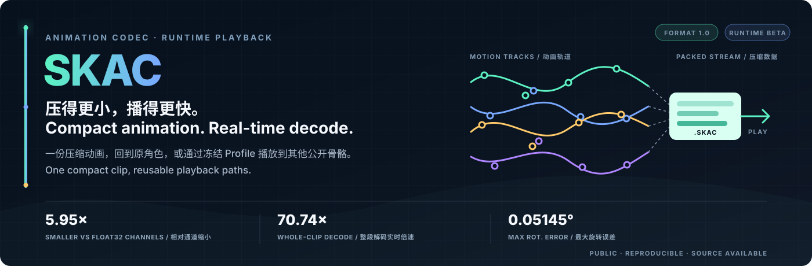
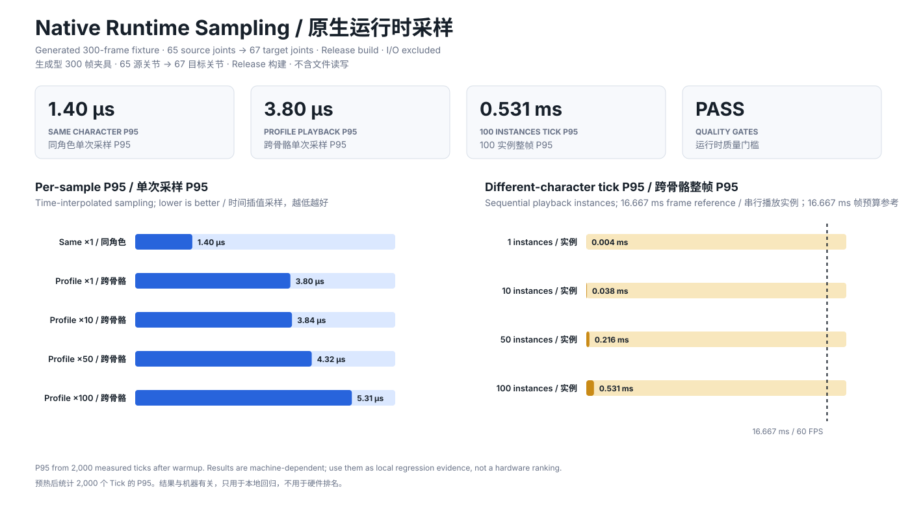

<p align="center">
  
</p>

<p align="center">
  <a href="#english">English</a> · <a href="#chinese">中文</a> ·
  <a href="FORMAT.md">SKAC Format</a> · <a href="SKACPACK.md">SKAC Pack</a> ·
  <a href="MOTION_GEN_BETA.md">Motion Gen Beta</a> · <a href="RUNTIME_BETA.md">Runtime Beta</a> ·
  <a href="QUALITY_GATES.md">Quality Gates</a>
</p>

<a id="english"></a>

## English

SKAC turns character-animation libraries into much smaller deployable `.skac` assets
and decodes them fast enough for real-time playback. For a shipped product, that means
smaller builds and patches, lower distribution and storage costs, and room for more
animation inside the same content budget. One compressed animation can play on its
source character or, through a frozen Profile, on another public skeleton.

This is the public academic side of that system. The repo makes compression and
cross-skeleton playback measurable, and keeps their results separate so Codec
reconstruction error cannot be presented as retargeting quality.

The `Zz1S/beta-motion-gen` branch is building the next layer without replacing the
deterministic Codec: SKAC v2 adds motion-adaptive and progressive storage, SKAC Pack v1
adds a validated library container, and the optional SKAC Motion Runtime Beta will add
semantic in-betweening with a deterministic fallback. Public names use SKAC version
numbers only; experiment labels are not part of the format or API.

### Codec performance snapshot / Codec 性能展示


[Open the local Codec Explorer](reports/codec_explorer.html) and load your own public
BVH folder. The page starts with no selectable characters or animations; it creates
those options only from files the browser actually reads. Matching benchmark clips
unlock their measured Codec rows, while other local clips remain playback-only. Its
viewport switches between one, four, or eight characters and synchronizes every
matched clip on one timeline. The page works offline and uploads nothing.

This fixed-seed public run compressed and decoded the same 20 randomly selected
animations on eight characters: 160 BVH clips and 645.35 seconds of motion in total.
The high preset stored 32.57 MiB of float32 animated channels in 5.48 MiB of `.skac`
files, removing 27.09 MiB. Encoding all 160 clips took 273.94 seconds; summed median
whole-clip decode time was 9.12 seconds. Maximum local rotation error was 0.05145 degrees.

These are same-character Codec numbers, not cross-skeleton retargeting scores. File I/O
is excluded and performance is machine-dependent. The complete environment, sample
list, per-clip measurements, and checks are in
[`codec_showcase_8x20_public.json`](reports/codec_showcase_8x20_public.json). Reproduce
the run with:

```text
python tools/run_codec_showcase.py --data-root PUBLIC_MIXAMO_ROOT \
  --output reports/codec_showcase_8x20_public.json \
  --visual reports/codec_showcase_8x20_public.svg
```

It is a standalone academic project. It does not depend on product code, and it does
not ship characters, motions, datasets, or model weights. You bring public data from
its official source; this repo provides the protocol, runner, metrics, and a small
public baseline.

### What is here

- `skac_codec`: BVH I/O, the versioned `.skac` Codec, `.skacpack`, and CLI;
- `skac-agent`: a versioned JSON/JSONL interface for other Agents and automation;
- `native` and `integrations`: a C++ decoder plus Unity/Unreal Runtime Beta adapters;
- `QUALITY_GATES.md`: frozen reconstruction and playback-performance limits;
- `skac_codec.fbx`: an optional experimental Blender bridge for FBX characters;
- `skac_public_core`: a deterministic NumPy-only cross-skeleton baseline;
- `skac_benchmark`: manifest loading, validation, metrics, and the command-line runner;
- `tools`: SAN-compatible scoring, public baseline runners, hashing, and release checks;
- `tests`: unit tests for the evaluator and public core;
- `manifests`: a template showing the accepted sample format;
- `reports`: aggregate results from completed public-data runs.

The benchmark keeps two distinctions explicit:

1. SAN's paper formula and official-code metric are reported separately.
2. Retargeting error and codec round-trip error are different measurements. One must
   not be reported as the other.

The automatic track uses one frozen profile per skeleton pair. Tuning individual
animations is not allowed. Manually polished animation belongs in a separate Artist
Gold track.

### Run it

Python 3.10+ and NumPy are enough for the benchmark itself.

```text
python -m unittest discover -s tests -v
python -m skac_codec encode input.bvh -o motion.skac --quality high
python -m skac_codec inspect motion.skac
python -m skac_codec pack-create --clip idle=idle.skac --clip walk=walk.skac -o library.skacpack
python -m skac_codec pack-inspect library.skacpack
python -m skac_codec pack-extract library.skacpack walk -o walk-restored.skac
python -m skac_codec decode motion.skac -o restored.bvh
python -m skac_codec profile motion.skac target.bvh -o target.skac-profile.json
python -m skac_codec runtime-skeleton target.bvh -o target.runtime-skeleton.json
python -m skac_codec decode motion.skac --target target.bvh --profile target.skac-profile.json -o target-animation.bvh
python -m skac_codec quality-gate-same source.bvh --output reports/same.json --visual reports/same.svg
python -m skac_codec quality-gate-different source.bvh target.bvh --output reports/different.json --visual reports/different.svg
skac-agent capabilities --pretty
skac-agent run --workspace ./job --request ./request.json --pretty
python -m skac_codec fbx-inject target.fbx target-animation.bvh -o animated-target.fbx --blender BLENDER
python -m skac_benchmark evaluate manifests/samples.template.jsonl --output reports/metrics.json
python tools/audit_release.py .
```

Run the commands from the repo root. Make a copy of the manifest template for your
experiment; do not put local dataset manifests into Git.

For automated callers, `AGENT_CLI.md` defines the request envelope, path sandbox,
operations, responses, and exit codes. The stable Agent protocol covers the tested BVH
workflow; it does not currently expose the experimental FBX bridge.

For engine playback, `RUNTIME_BETA.md` documents the native C ABI and the Unity/Unreal
source adapters. The Beta now covers whole-clip same-character decoding and native
Profile 2.0 playback into a different target skeleton. Streaming and automatic engine
coordinate conversion remain later work.



The generated Release fixture measures time-interpolated sampling after warmup: 1.40 µs
P95 for a 65-joint same-character sample, 3.80 µs for one 65-to-67-joint Profile sample,
and 0.531 ms P95 for 100 sequential Profile instances. These machine-dependent numbers
are local regression evidence; fixture, thresholds, and all percentiles are recorded in
[`native_runtime_profile_beta.json`](reports/native_runtime_profile_beta.json).

### Where the data goes

Keep datasets, characters, motions, generated BVH files, checkpoints, and pretrained
weights outside this repository. The manifest accepts relative paths under a data root
that you choose when running the benchmark. Absolute paths and path traversal are
rejected.

This repo may publish an official download page and a SHA-256 hash so another
researcher can obtain the same file. It does not re-host that file. A source-code
license also does not automatically cover a separately released dataset or checkpoint.

### Current state

The public core can build a frozen source-to-target profile, map different joint sets,
copy mapped local rotations, keep unmatched target joints at identity, and scale root
translation by skeleton height. It is deliberately small and readable. It is a public
baseline, not a claim of feature parity with any non-public system.

The public Codec now provides a real BVH-to-`.skac`-to-BVH path. Format 1.0 uses
smallest-three quaternion coding, bounded uniform translation quantization, bit-level
packing, zlib compression, skeleton hashing, declared payload lengths, and CRC checks.
Every encode command immediately decodes the produced bytes and prints its rotation,
translation, compression-ratio, and bits-per-joint-per-frame measurements.

The same `.skac` file can also target multiple BVH skeletons through hash-pinned,
one-time profiles. Profile 2.0 recognizes naming conventions, compiles hierarchy work
and basis quaternions ahead of playback, and exposes a reusable frame runtime with
caller-owned output buffers. See `FORMAT.md`, `RETARGETING.md`, and `QUALITY_GATES.md`.

This is still a deterministic reference implementation. Production twist
distribution, end-effector IK, and robust contact locking remain later milestones. An
experimental Blender FBX bridge is included, but it has not completed a real FBX round
trip on this development machine; see `FBX.md` before using it.

The `reports` directory contains nine aggregate records:

- a Codec 1.0 round-trip smoke test on one public SAN BVH;
- a one-file, two-target public retargeting smoke test;
- an official SAN public-test reproduction;
- a simple public rotation-copy pipeline trial;
- a full SAN run using `skac_public_core`;
- a same-character Codec gate with a matching SVG summary;
- a different-character Profile 2.0 playback gate with a matching SVG summary;
- a native same/different-character sampling benchmark with a matching SVG summary;
- an eight-character, 160-clip Codec compression and decode showcase.

The reports keep the scoring definitions beside the numbers. Raw motions and generated
predictions are not included.

### Before publishing a fork

Read `SECURITY.md`, `THIRD_PARTY_NOTICES.md`, and `RELEASE_CHECKLIST.md`. The short
version is simple: publish code, tests, protocols, templates, hashes, and aggregate
scores; do not publish third-party data, weights, motion assets, machine paths, or raw
logs.

Original code in this repository is licensed under Apache-2.0. Upstream projects and
downloaded materials keep their own licenses and terms.

### References

- R2ET: https://semanticdh.github.io/R2ET/
- R2ET code: https://github.com/Kebii/R2ET
- Skeleton-Aware Networks: https://deepmotionediting.github.io/retargeting
- Skeleton-Aware Networks code: https://github.com/DeepMotionEditing/deep-motion-editing

[跳到中文](#chinese)

---

<a id="chinese"></a>

## 中文

SKAC 会把角色动画库压成体积更小、可以直接发布的 `.skac` 资产，并以足够实时播放的速度
解码。对产品来说，这意味着更小的安装包和补丁、更低的分发与存储成本，也意味着同样的
内容预算可以装下更多动画。同一份压缩动画既能回到原角色播放，也能通过冻结的 Profile
播放到另一套公开骨架。

这里是它的公开学术分支，负责把压缩和跨骨骼播放都做成可测、可复现的流程，同时把两类
结果分开，避免拿 Codec 还原误差冒充重定向质量。

### Codec 性能展示 / Codec performance snapshot


[打开仓库内的本地 Codec Explorer](reports/codec_explorer.html) 后，先载入你自己的公开 BVH
文件夹。页面初始不会提供任何可选角色或动画，只有浏览器实际读取成功后才生成选项；匹配到基准
清单的动画会显示对应实测 Codec 数据，其他本地动画只播放、不冒充跑分。视窗支持单角色、四角色
和八角色模式，匹配到的动作共用一条时间轴同步播放。页面离线运行，不上传任何文件。

这次公开测试固定了随机种子，让八个角色使用同一组随机抽出的 20 条动画，共 160 个 BVH、
645.35 秒动作。high 档把 32.57 MiB 的 float32 动画通道存成了 5.48 MiB 的 `.skac` 文件，
实际减少 27.09 MiB；160 条动画累计编码耗时 273.94 秒，整段解码中位耗时之和为 9.12 秒，
最大局部旋转误差为 0.05145 度。

这些是同角色 Codec 数据，不是跨骨骼重定向分数。计时不包含文件读取，并且性能数字跟机器
有关。完整环境、抽样名单、逐动画结果和门槛见
[`codec_showcase_8x20_public.json`](reports/codec_showcase_8x20_public.json)。复现命令：

```text
python tools/run_codec_showcase.py --data-root PUBLIC_MIXAMO_ROOT \
  --output reports/codec_showcase_8x20_public.json \
  --visual reports/codec_showcase_8x20_public.svg
```

它是一个独立的学术项目，不接产品工程，也不把角色、动画、数据集和模型权重塞进仓库。
公开数据由使用者从官方来源获取；这里负责协议、运行器、指标，以及一个足够小、能看懂的
公开基线。

### 这里现在有什么

- `skac_codec`：BVH 读写、版本化 `.skac` 容器、编码器、解码器和命令行工具；
- `skac-agent`：给其他 Agent 和自动化程序调用的版本化 JSON/JSONL 接口；
- `native` 和 `integrations`：C++ 解码核心，以及 Unity/Unreal Runtime Beta 适配层；
- `QUALITY_GATES.md`：固定的还原质量和播放性能门槛；
- `skac_codec.fbx`：通过 Blender 处理 FBX 角色的可选实验适配层；
- `skac_public_core`：只依赖 NumPy 的确定性跨骨骼基线；
- `skac_benchmark`：清单读取、合法性检查、指标和命令行入口；
- `tools`：SAN 兼容评分、公开基线运行器、哈希和发布审计；
- `tests`：评测器和公开核心的单元测试；
- `manifests`：样本清单格式模板；
- `reports`：已经完成的公开数据实验汇总。

有两件事这里会一直分开写，避免把数字说混：

1. SAN 论文公式和官方代码指标分别报告。
2. 重定向误差和 Codec 压缩/解压误差是两层质量，不能拿后者冒充前者。

自动赛道里，每一对骨架只能配置一次，然后冻结。不能针对某一段动画单独调。逐动画人工
修正可以做，但要单列为 Artist Gold，不能跟自动结果混在一起。

### 怎么跑

评测器本身只需要 Python 3.10+ 和 NumPy。

```text
python -m unittest discover -s tests -v
python -m skac_codec encode input.bvh -o motion.skac --quality high
python -m skac_codec inspect motion.skac
python -m skac_codec pack-create --clip idle=idle.skac --clip walk=walk.skac -o library.skacpack
python -m skac_codec pack-inspect library.skacpack
python -m skac_codec pack-extract library.skacpack walk -o walk-restored.skac
python -m skac_codec decode motion.skac -o restored.bvh
python -m skac_codec profile motion.skac target.bvh -o target.skac-profile.json
python -m skac_codec runtime-skeleton target.bvh -o target.runtime-skeleton.json
python -m skac_codec decode motion.skac --target target.bvh --profile target.skac-profile.json -o target-animation.bvh
python -m skac_codec quality-gate-same source.bvh --output reports/same.json --visual reports/same.svg
python -m skac_codec quality-gate-different source.bvh target.bvh --output reports/different.json --visual reports/different.svg
skac-agent capabilities --pretty
skac-agent run --workspace ./job --request ./request.json --pretty
python -m skac_codec fbx-inject target.fbx target-animation.bvh -o animated-target.fbx --blender BLENDER
python -m skac_benchmark evaluate manifests/samples.template.jsonl --output reports/metrics.json
python tools/audit_release.py .
```

在仓库根目录运行。正式实验时复制一份清单模板来填，不要把本机的数据清单提交进 Git。

自动化调用的请求格式、路径沙箱、响应和退出码都写在 `AGENT_CLI.md`。稳定版 Agent
协议目前只覆盖已经验证过的 BVH 流程，不开放实验性的 FBX 桥。

引擎运行时接入见 `RUNTIME_BETA.md`，里面说明了原生 C ABI 和 Unity/Unreal 源码适配层。
当前 Beta 已经覆盖整段载入、同角色解码，以及通过 Profile 2.0 直接采样到不同目标骨骼；
流式解码和引擎坐标自动转换仍是后续工作。


生成型 Release 夹具会在预热后测量带时间插值的采样：65 关节同角色单次采样 P95 为
1.40 微秒，65 到 67 关节的单个 Profile 采样 P95 为 3.80 微秒，100 个 Profile 实例串行
整帧 P95 为 0.531 毫秒。这些数字跟机器有关，只作为本地回归证据；夹具、门槛和全部
百分位都记录在 [`native_runtime_profile_beta.json`](reports/native_runtime_profile_beta.json)。

### 数据放哪

数据集、角色、动作、生成的 BVH、检查点和预训练权重都放在仓库外面。运行时指定一个数据
根目录，清单里只写它下面的相对路径。绝对路径和路径穿越会被评测器直接拒绝。

仓库可以记录官方下载页和 SHA-256，方便别人拿到同一个文件，但不替官方重新分发。还有
一点容易弄混：一个项目的源码许可证，并不自动等于它的数据和权重也能随便上传。

### 现在做到哪了

公开核心已经能生成冻结的源骨架到目标骨架 Profile，处理不同关节集合，复制已映射关节的
局部旋转，让未映射关节保持单位旋转，并按骨架高度缩放根位移。实现刻意保持得比较小，
方便检查。它是公开基线，不代表与任何非公开系统功能一致。

公开 Codec 现在已经能真正跑通 `BVH → .skac → BVH`。格式 1.0 使用 smallest-three
四元数编码、有界均匀位移量化、位级打包、zlib 压缩、骨架哈希、长度校验和 CRC。每次
编码都会立刻从生成的字节解码一次，并输出旋转误差、位移误差、压缩比和每关节每帧位数。

同一个 `.skac` 现在也能通过一次性冻结并锁定哈希的 Profile 输出到多个 BVH 目标骨架。
Profile 2.0 会在播放前识别命名体系、编译层级顺序和基变换四元数；逐帧运行时复用缓冲区，
不再临时做骨架匹配和矩阵转换。具体见 `FORMAT.md`、`RETARGETING.md` 和
`QUALITY_GATES.md`。

这仍然是确定性参考实现。生产级 Twist 分配、末端 IK 和稳定接触锁定仍是后续里程碑。
仓库已经包含实验性的 Blender FBX 适配层，但这台开发机还没有完成真实 FBX 往返验证；
使用前请先看 `FBX.md`。

`reports` 里目前有九份汇总记录：

- 一份使用公开 SAN BVH 的 Codec 1.0 往返测试；
- 一份“单文件、双目标”的公开重定向测试；
- SAN 官方公开测试复现；
- 一个简单的公开旋转复制管线试验；
- 使用 `skac_public_core` 跑完的 SAN 测试；
- 一份同角色 Codec 门槛，以及对应的 SVG 可视化摘要；
- 一份不同角色 Profile 2.0 播放门槛，以及对应的 SVG 可视化摘要；
- 一份原生同角色/不同角色采样基准，以及对应的 SVG 可视化摘要；
- 一份八角色、160 条动画的 Codec 压缩与解码性能展示。

每份报告都会把数字和对应口径放在一起。原始动作和生成结果不会随仓库发布。

### 准备公开之前

先看 `SECURITY.md`、`THIRD_PARTY_NOTICES.md` 和 `RELEASE_CHECKLIST.md`。简单说就是：
代码、测试、协议、空模板、哈希和汇总分数可以发；第三方数据、模型权重、动作资产、本机
路径和原始日志不要发。

本仓库的原创代码使用 Apache-2.0。上游项目和外部下载材料继续遵守它们自己的许可证与
使用条款。

### 参考项目

- R2ET：https://semanticdh.github.io/R2ET/
- R2ET 官方代码：https://github.com/Kebii/R2ET
- Skeleton-Aware Networks：https://deepmotionediting.github.io/retargeting
- Skeleton-Aware Networks 官方代码：https://github.com/DeepMotionEditing/deep-motion-editing

[Jump to English](#english)
